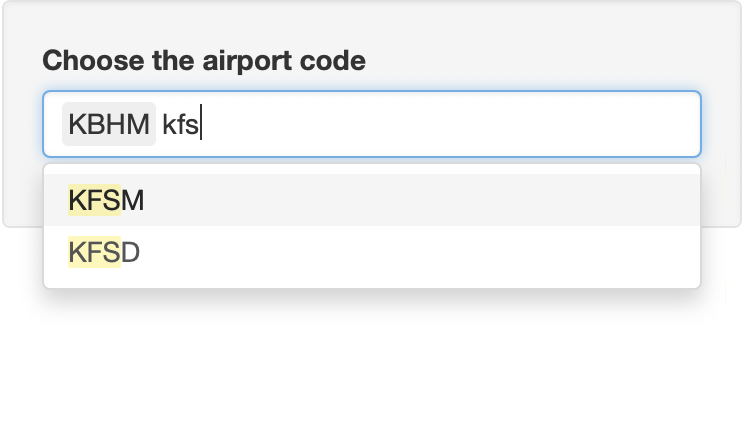
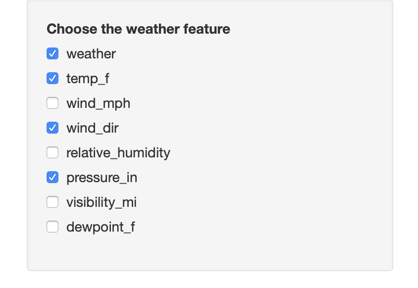
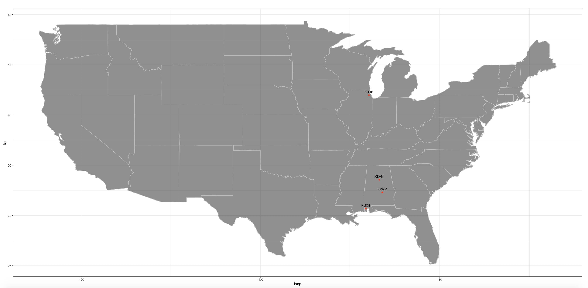
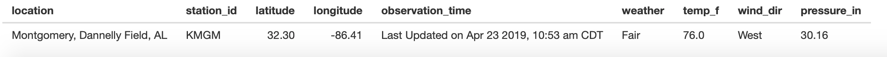

# airportweather 

[](https://travis-ci.org/floatgreen/airportweather)
[](https://codecov.io/github/floatgreen/airportweather?branch=master)


The goal of airportweather is to read the current weather component(s) from "https://w1.weather.gov/xml/current_obs/" and record the information as data frame or plot it on an US map.

## Installation

You can download the package "airportweather" from [github](https://github.com/floatgreen/airportweather), then install (build) it with ctrl+shift+B.

Or you can also install the package using `devtools`:

``` r
library(devtools)
install_github("floatgreen/airportweather")
```

## Example

Followings are some examples which shows you how to use this package:  
Read the data of one airport.  
If the components' names do not exist or the data is missing, the result data frame shows NA(s).

``` r
current_weather("KAMW", c("wind_mph", "temp_f", "haha"))
current_weather("KAMW", "temp_c")
```

Read the data of many airports.

``` r
current_weather_more(c("KAMW", "KAIO", "KCID", "KCNC"), c("temp_f"))
current_weather_more(c("KAMW", "KAIO", "KCID", "KCNC"), c("temp_f", "wind_mph"))
```

Plot one component of several airports on the map of US.

``` r
plot_weather(c("KAMW", "KAIO", "KCID", "KCNC"),
            type = "weather",
            label = TRUE, number = FALSE)
            
plot_weather(c("KAMW", "KAIO", "KCID", "KCNC"),
            type = "temp_f",
            label = TRUE, number = TRUE)
```

Plot one component of the airports chosen by user and the user's position on the map of US.

``` r
plot_position(c("KAMW", "KAIO"), type = "temp_f", you.long = -100, you.lat = 35,number = TRUE)
```

Plot one component of all airports and the user's position on the map of US with contour lines. It takes a couple of seconds to run. The component has to be continues.

``` r
plot_weather_us(type = "temp_c",you.long = -100, you.lat = 35,bin = 0.5)
```

## Shiny app

Launch shiny spp, and you should see the panel as below

``` r
runShiny()
```


Choose the airport code by typing the letter or just choose from menu. When you type letter, the menu will show all choice with the letters. You can choose multyple airport.




Choose the weather feature by clicking on the box. You can also choose several weather feature on this panel.



After selection of airport code and weather feature, a map with the airport position will be shown below the choice box.



Using your mouse to click on the airpot point, the table of selected weather infomation will be shown in the table below the map.



