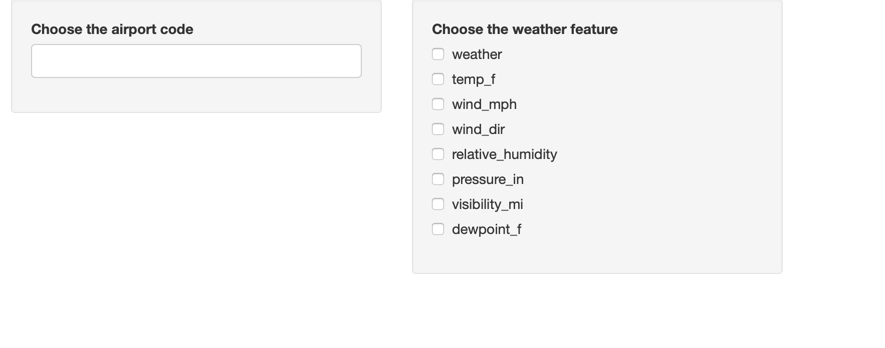
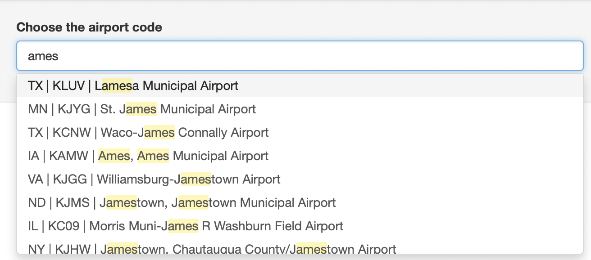
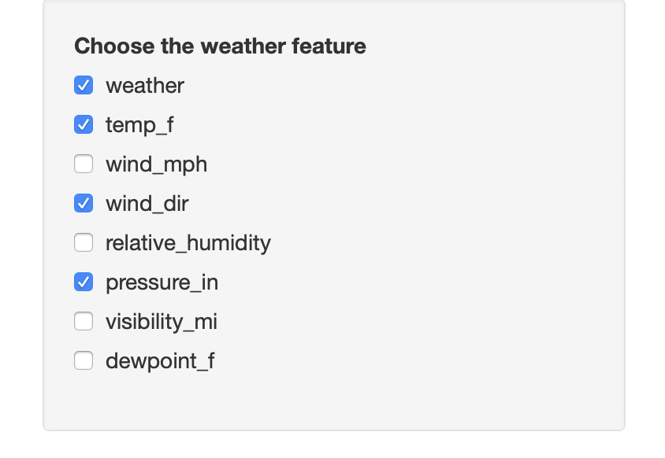
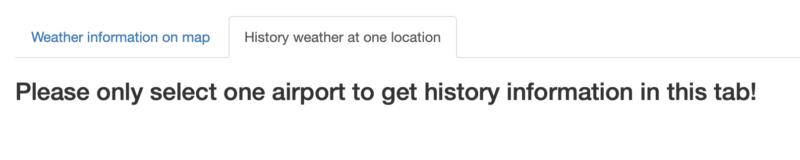

# airportweather 

[](https://travis-ci.org/floatgreen/airportweather)
[](https://codecov.io/github/floatgreen/airportweather?branch=master)


The goal of airportweather is to read the current weather component(s) from "https://w1.weather.gov/xml/current_obs/" and record the information as a data frame or plot it on a US map. Find more information at "https://floatgreen.github.io/airportweather/".

## Installation

You can download the package "airportweather" from [github](https://github.com/floatgreen/airportweather), then install (build) it with ctrl+shift+B.

Or you can also install the package using `devtools`:

``` r
library(devtools)
install_github("floatgreen/airportweather")
```

## Example

Followings are some examples which show you how to use this package:  
Read the data of one airport.  
If the components' names do not exist or the data is missing, the result data frame shows NA(s).

``` r
current_weather("KAMW", c("wind_mph", "temp_f", "haha"))
current_weather("KAMW", "temp_c")
```

Read the data of many airports.

``` r
current_weather_more(c("KAMW", "KAIO", "KCID", "KCNC"), c("temp_f"))
current_weather_more(c("KAMW", "KAIO", "KCID", "KCNC"), c("temp_f", "wind_mph"))
```

Plot one component of several airports on the map of US.

``` r
plot_weather(c("KAMW", "KAIO", "KCID", "KCNC"),
            type = "weather",
            label = TRUE, number = FALSE)
            
plot_weather(c("KAMW", "KAIO", "KCID", "KCNC"),
            type = "temp_f",
            label = TRUE, number = TRUE)
```

Plot one component of the airports chosen by user and the user's position on the map of US.

``` r
plot_position(c("KAMW", "KAIO"), type = "temp_f", you.long = -100, you.lat = 35,number = TRUE)
```

Plot one component of all airports and the user's position on the map of US with contour lines. It takes a couple of seconds to run. The component has to be continuous.

``` r
plot_weather_us(type = "temp_c",you.long = -100, you.lat = 35,bin = 0.5)
```

Retrieve history weather and temperature data for 3 days of one airport location. 

``` r
obhistory("KAMW")
```

Plot the air temperature history for 3 days of one airport location.

``` r
plot_temp_history("KORD")
```

## Shiny app

Launch shiny spp, and you should see the panel as below

``` r
runShiny()
```



Choose the airport code by typing the letter or just choose from menu. When you type letter, the menu will show all choice with the letters. You can choose multiple airport.




Choose the weather feature by clicking on the box. You can also choose several weather feature on this panel.



After selection of airport code and weather feature, a map with the airport position will be shown below the tab `Weather information on map`. The map shows the airports you selected, with the selected weather information on the points. You can also drag, zoom in or zoom out the map.


Below the map, you can also see a table with selected weather information as well as airport location information for selected airport.


When you switch to the tab `History weather at one location`, you will see a reminder if you choose more than one location. The tab shows the lastest 72h temperature for an airport, so you can only choose one location.



The history temperature plot shows 3 days temperature records, which presented as three different colors.


A detailed temperature history table is shown below the temperature plot. It includes all temperature records for every hour. You can also search a certain time, weather or temperature in the search box.


