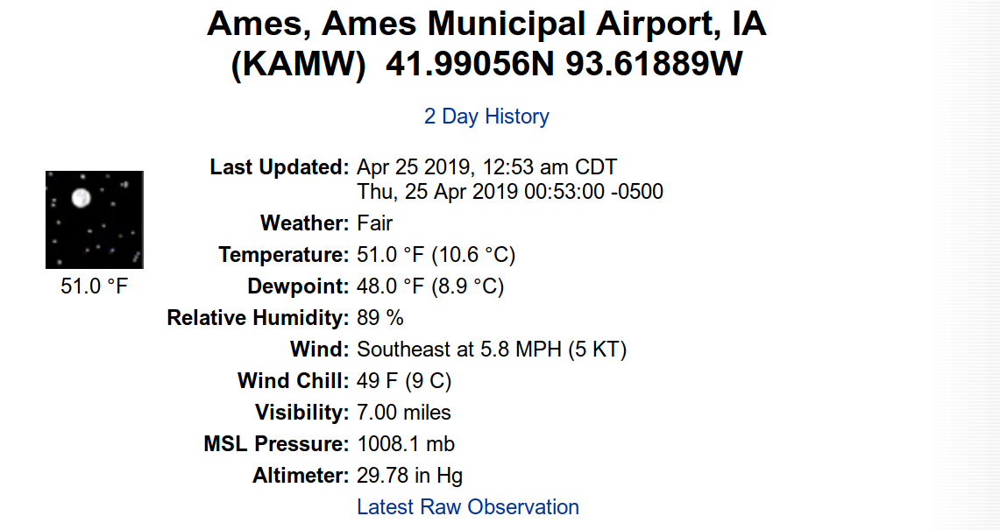
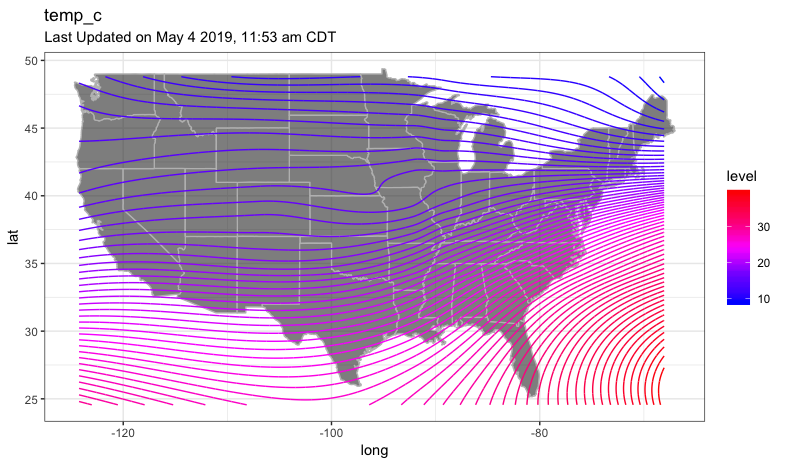
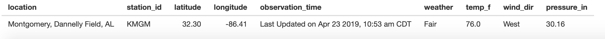
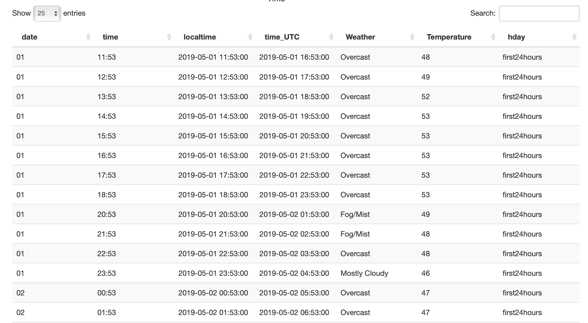

```{r, include = FALSE}
knitr::opts_chunk$set(
  collapse = TRUE,
  comment = "#>"
)
```

```{r setup, echo=FALSE}
library(airportweather)
```


## Introduction

The National Weather Service site  https://w1.weather.gov/xml/current_obs/ provides access to observed current weather conditions for about 2,367 locations across 58 US States and Territories. 

```{r, out.width = '100%', echo = FALSE}
knitr::include_graphics("../man/figures/select_state_location.png")
```

With the XML link for an airport code (e.g. KAMW), users can access current weather report for the airport location. Different kinds of weather associated data is shown on the webpage. For instance, the page displays   

```{r, out.width = '100%', echo = FALSE}

```


Actually, the XML file contains more than 20 different types of weather data, as well as the location and time information of the observations. Further more, a link to "2 Day History" gives access of an HTML page containing weather history data for past 72 hours. 

```{r, out.width = '100%', echo = FALSE}

```

Thanks to the well-organized weather data structure from the National Weather Service website, the user can easily explore both the spatial and temporal aspect of weather of selected locations. The site also provides the Zip files containing all XML files of the current and updated hourly. However, people may be only interested in some selected sites and do not bother to download big whole data. Also, the XML and HTML formats need to be converted to data frames before downstream analysis. Web scraping is a natural idea to handle this. The package `airportweather` is designed as an efficient tool to scrape, extract, integrate and visualize the weather data of airport locations. The advantage of the package is it scrapes real-time data from the web when calling functions in the package, so the most up-to-date data is obtained.


## Package data preparation

The primer key of the weather data is **4 character CODE** of airport locations. Scraping from the root page https://w1.weather.gov/xml/current_obs/ , we have collected all current airport code together with the name of location and the state/territory abbreviations correspond to the code. The data set `all_code.rda` contains 2,367 US airport codes from 58 state/territory. This data is used as the package example data to provide currently valid codes of US airports. However, if new codes are added in the National Weather Service site, the `airportweather` package will still work as long as the format of webpage and structure of the site keeps the same.


```{r, results = "asis", echo = FALSE}
data(package = "airportweather", "all_code")
kableExtra::kable(head(all_code)) %>% kableExtra::kable_styling(bootstrap_options = "striped", full_width = F )

#pander::pandoc.table(head(all_code))
```


## Installation

```{r eval = FALSE}
devtools::install_github("floatgreen/airportweather")
```


## Functions

### current_weather(id,type)

The `current_weather` function is the basic function for data retrieving. It reads the weather information of an airport from XML file on National Weather Service website (e.g., https://w1.weather.gov/xml/current_obs/KAMW.xml), and output a single row data frame of location, station_id, latitude, longitude,	observation_time, and selected types of the weather elements.

Description of input parameters are as follows:

|Parameter|Description|Type|
|:---|:---|:---|
|id| one 4-letter airport code |chr|
|type|a vector of weather elements|chr vector|

The possible types of elements the function can deal with are

- weather 
- temp_f 
- wind_mph 
- wind_dir 
- relative_humidity 
- pressure_in 
- visibility_mi 
- dewpoint_f


```{r, eval=FALSE}
 current_weather("KAMW", c("wind_mph", "temp_f", "relative_humidity"))
```


```{r, results = "asis", echo = FALSE}
c_weather<- current_weather("KAMW", c("wind_mph", "temp_f"))
kableExtra::kable(c_weather) %>% kableExtra::kable_styling(bootstrap_options = "striped", full_width = F )
```


### current_weather_more(id_vector, type)

The `current_weather_more` function calls the `current_weather` function to retrieving weather elements for multiple airports, and output integrated data frame for multiple airports.

|Parameter|Description|Type|
|:---|:---|:---|
|id| one 4-letter airport code |chr vector|
|type|a vector of weather elements|chr vector|


```{r, eval=FALSE}

current_weather_more(c("KAMW", "KAIO", "KCID", "KCNC"), c("wind_mph", "temp_f", "relative_humidity"))

```


```{r, results = "asis", echo = FALSE}
c_weather<- current_weather_more(c("KAMW", "KAIO", "KCID", "KCNC"), c("wind_mph", "temp_f", "relative_humidity"))
kableExtra::kable(c_weather) %>% kableExtra::kable_styling(bootstrap_options = "striped", full_width = F )
```


 


### plot_position()

The`plot_position` function plot one weather component of the airports chosen by user and the user's position on the map of US.

Description of input parameters are as follows:

|Parameter|Description|Type|
|:---|:---|:---|
|id_vector|a vector of  multiple airport codes|chr vector|
|type|a weather elements|chr |
|you.long| user provided longitude |num|
|you.lat| user provided latitude |num|
|number|number= true: this element is numeric|logical|


```{r}
plot_position(c("KAMW", "KAIO"), type = "temp_f", you.long = -100, you.lat = 35,number = TRUE)
```


### plot_weather()

The`plot_weather` function plot one weather component of several airports on the map of US. The first argument is a vector contains 

Description of input parameters are as follows:

|Parameter|Description|Type|
|:---|:---|:---|
|id_vector|a vector of multiple airport codes|chr vector|
|type|a weather element |chr|
|label|label= TRUE: label airport code on the plot|logical|
|number|number= TRUE: this element is numeric|logical|


The component can be factorial type, such as "weather", 

```{r}
plot_weather(c("KAMW", "KAIO", "KCID", "KCNC"),
            type = "weather",
            label = TRUE, number = FALSE)
            

```

or numerical/continuous type, such as "temp_f"
```{r}
plot_weather(c("KAMW", "KAIO", "KCID", "KCNC"),
            type = "temp_f",
            label = TRUE, number = TRUE)
            
```


            
### plot_weather_us()

The `plot_weather_us` function plot one component of all airports and the user-provided position on the map of US with contour lines. The component has to be continues, such as "temp_c".

Description of input parameters are as follows:

|Parameter|Description|Type|
|:---|:---|:---|
|type|a weather elements|chr|
|you.long| user provided longitude |num|
|you.lat| user provided latitude |num|
|bin|the binwidth of the contour lines|num|


```{r, eval = FALSE }
plot_weather_us(type = "temp_c", you.long = -100, you.lat = 35,bin = 0.5)
```
It takes relatively long time to run this function. Below is a previous result as a demonstration.

```{r, out.width = '90%', echo = FALSE}


```


### obhistory()

Usually, the `weather condition` (Sunny, Fog, etc..) and `air temperature`( in degrees Fahrenheit) are two most important elements in weather data. As a tiny tool, obhistory() is able to retrieve 3 days history of weather and temperature of one location. This function extracts a table from HTML and selects weather and air temperature as the variables of interest. The output is a data frame of 9 columns.

```{r,eval = FALSE }
obhistory("KAMW")
```


```{r, results = "asis", echo = FALSE}
KAMW_Table <- obhistory("KAMW")
kableExtra::kable(head(KAMW_Table)) %>% kableExtra::kable_styling(bootstrap_options = "striped", full_width = F )
```

The description of each variable is as follows:

|Variable|Description|Type| 
|:---|:---|:---|
|code|4 character airport code|chr|
|loc_name|name of the airport location|chr|
|date|the same as in the original html table|chr|
|time|the same as in the original html table|chr|
|localtime|the local time of observations|chr|
|time_UTC|UTC time|POSIXct|
|Weather|the Weather|Factor|
|Temperature|define the 1st, 2nd and 3rd 24 hours|Factor|

Note that the returned data frame has various number of rows, as the observation frequency is not fixed at each airport site. For instance, KAMW, where the weather data collected every hour will return 72 rows, while  KORD, where data updated every 20 minutes, will return 216 rows. Furthermore, at some locations, the observation time points are not evenly distributed. So it will be important that the table contains detailed time information. A POSIXct formatted time variable (in UTC) is also generated based on data. If the user needs to compare data from different time zones, the UTC time will make things tidier. 


### plot_temp_history()

It is interesting to explore the time series of air temperature for 3 days until the current time. `plot_temp_history()` can easily generate a ggplot figure with the airport location name in the title. The plot was grouped and colored by every 24 hours. 
```{r}
plot_temp_history("KAMW")
```


### runShiny()

A shiny app was designed to demonstrate selected functions in the `airportweather` package. The spatial visualization tab, "Weather information on map",  call `current_weather_more` to show selected weather variables for single or multiple airports on interactive Maps with `leaflet`, and generate an integrated table for multiple locations as well.


```{r, eval = FALSE }
runShiny()
```


```{r, out.width = '100%', echo = FALSE}
knitr::include_graphics("../man/figures/map.png")


```


The temporal visualization tab, "History weather at one location", call `plot_temp_history` to generate a time-series plot of temperature for past 3 days at one airport location,  and call `obhistory` to generate a table of weather and temperature history of the past 3 days.

```{r, out.width = '100%', echo = FALSE}
knitr::include_graphics("../man/figures/temp_plot.png")

```


## future work

We can retrieve and plot more continuous data such as Relative Humidity for the past 3 days.

